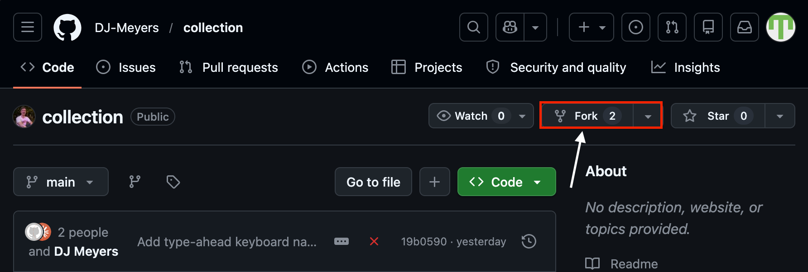
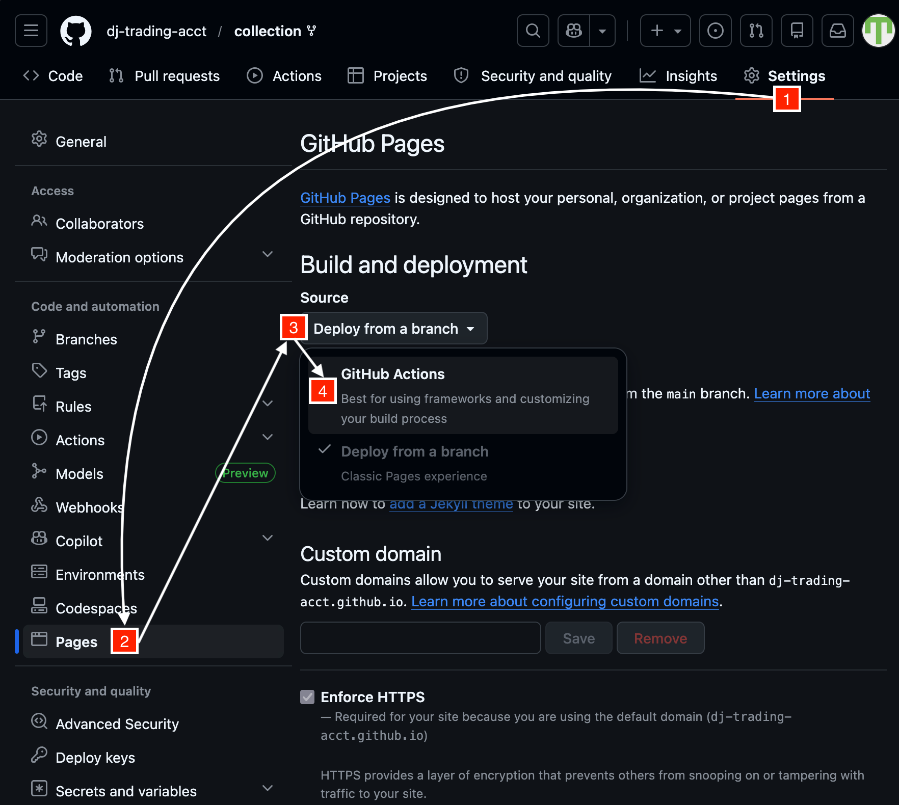
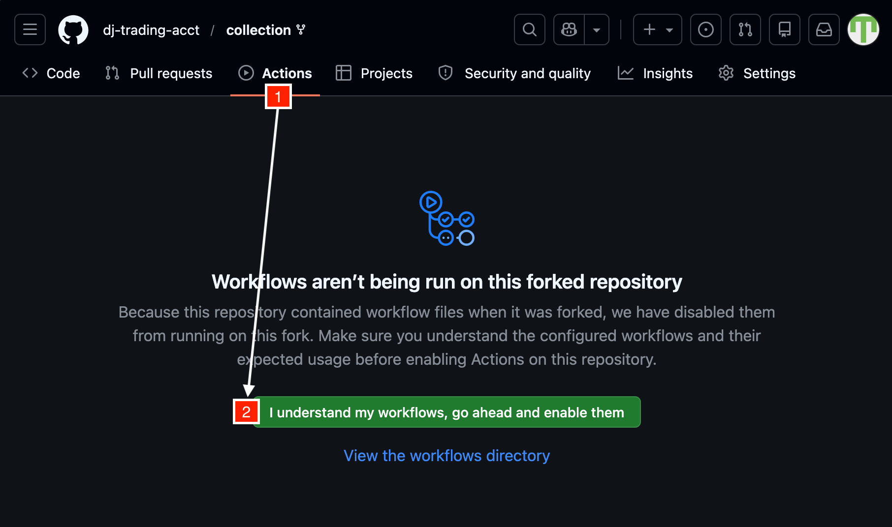
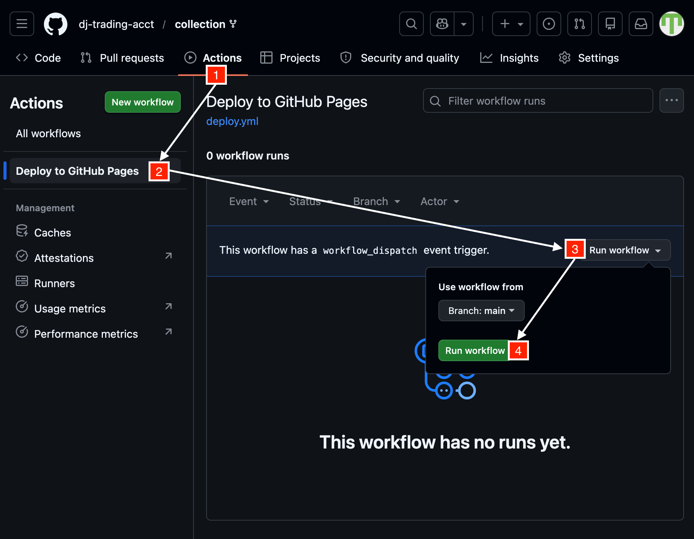

# Pokemon Collection Tracker

A static site for tracking your Pokemon collection. Runs on GitHub Pages and uses the GitHub API to save changes back to your repo.

## Setup

### 1. Fork the repository



### 2. Enable GitHub Pages

Go to **Settings > Pages**, and select **GitHub Actions** under **Source**.



### 3. Enable GitHub Actions

Go to the **Actions** tab on your fork and enable workflows.



### 4. Deploy the site

Go to the **Deploy to GitHub Pages** action and click **Run workflow**



### 5. Authenticate

Go to `https://<your-username>.github.io/collection/` and click **Sign in to edit** and follow the instructions to begin managing your collection

## How it works

The app uses a fine-grained PAT to commit collection data back to your fork via the GitHub API. Your token stays in your browser's localStorage and is sent directly to GitHub over HTTPS — there is no backend. The token is scoped to a single repo with minimal permissions.

- Collection data lives in `public/data/collection.json` in your repo
- The app loads this file on page load
- Saving commits the updated JSON back to your repo via the GitHub API
- The app detects the repo owner and name from the `.github.io` hostname
- Only users with push access to the repo can save changes

## Local development

```bash
pnpm install
pnpm dev
```

Runs at `http://localhost:5173`. Local dev treats any authenticated user as the owner.
